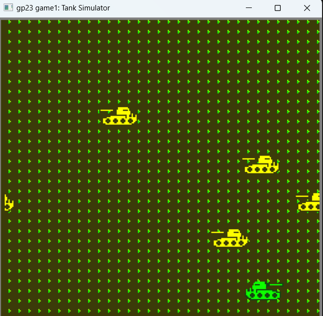

# Tank Simulator

Author: Yiqu(Pearson) Zhu

Design: In the game, player would fire bullet towards enemy and therby defeat them.

Screen Shot:



How Your Asset Pipeline Works:
1. use www.pixilart.com to create a png with 4 color;[Tank](assets/Tank.png)
2. (If needed) use https://onlinepngtools.com/flip-png-horizontally to flip the png for another direction.[TankFlipped](assets/TankFlipped.png)
2. use https://pinetools.com/split-image to split the png into 8*8 image pieces.[TankSlipped](assets/Tank1.png)
3. use www.pixilart.com and the 4 color recorded previously ,to create 2*2 png of palette[TankPalette](assets/Tank_Pal.png)
4. load the 8x8 pieces ,then load the 2x2 palette
5. use bit computing method and the palette to create the tile
6. render them with palette index and tile index.
```c++
	for(uint8_t i=0;i<2;++i){	//player sprite:
		for(uint8_t j=0;j<4;++j){
			ppu.sprites[i*4+j].x = int8_t(player_at.x+8*j);
			ppu.sprites[i*4+j].y = int8_t(player_at.y-8*i);
			if(playerDirection==1||playerDirection==3){
				ppu.sprites[i*4+j].index = 45+i*4+j;
			}else{
				ppu.sprites[i*4+j].index = 35+i*4+j;
			}

			ppu.sprites[i*4+j].attributes = 3;
		}
	}
```
How To Play:
To move Around: up/down/left/right Arrow Key;
To fire a bullet: Space Key;


This game was built with [NEST](NEST.md).

